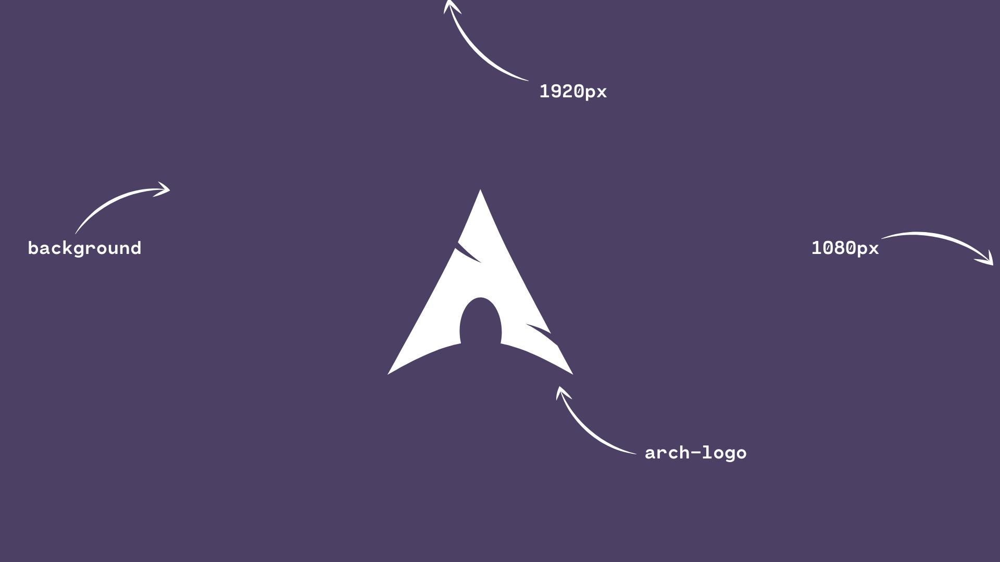

  

# Arch Linux minimal wallpapers

#### Check out the wallpapers [here](other/wallpapers.md)

This repsitory contains a **collection of minimal Arch wallpapers**, all the themes are made by two colors and look like the above template.

#### If you want to contribute to the repository, check [this file](other/contributing.md)

The themes have been created following the pallete of some famous color schemes, they have been created using two colors:

- The most important color: for the background of the wallpaper.
- The contrast / focus color of the pallete: for the Arch Linux logo.

This repository was originally created to implement a small script I programmed for changing the theme of the my terminal, my window manager ([qtile](https://qtile.org)) and my wallpaper. You can check my dotfiles [here](https://github.com/pablocorbalann/dotfiles)

Read the License of the repository [here](other/LICENSE)

###### Created by Pablo Corbalán [@pablocorbalann](https://github.com/pablocorbalann)
