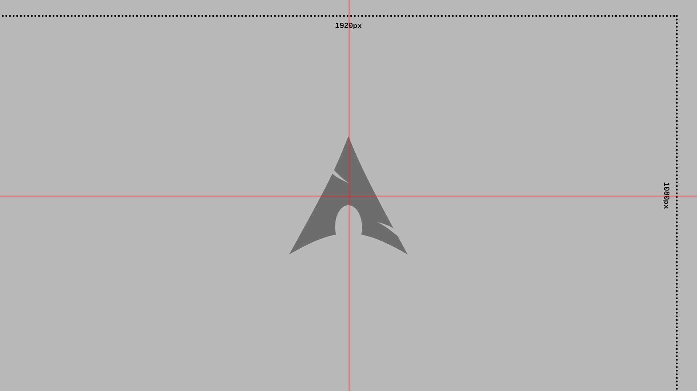

## Contributing to the repository

The very first thing you'll have to do is to **fork the repository**, and then **clone to your pc** your copy.

Modify the things you consider, and **commit the changes to your fork**, finally **push the changes** and then **make a pull request** to this repository.

In the following section you can check out more information about adding your own wallpaper:

### Adding a wallpaper
If you want to add a wallpaper, you'll need [git](git-scm), and an editor (for editing the wallpapers). You can use photoshop, gimp, krita etc.

First, download the following [template](template.svg), the template is another wallpaper, but the opacity of it has been reduced to 50%, and I have added some guides in the logo and in the borders.



Open the template in a photo editor, and modify the colors of it. Keep the dimensions. If you need it you can put any of [the wallpapers](../wallpapers/) in another layer, so that you do not have to take care about the guide lines. 

Once you have modified the colors, save the file inside the `wallpapers/` subfolder.

modify the file `other/wallpapers.md`, and **in alphabetical order**, add the name of your wallpaper as:

```markdown
---
### name-of-the-wallpaper

```

Please **add your wallpaper in all the resolutions**

Remember to add your wallpaper to the `.zip` file. You can use a GUI tool, or you can run:
```bash
$ zip -r resolution.zip wallpapers/resolution/
```
